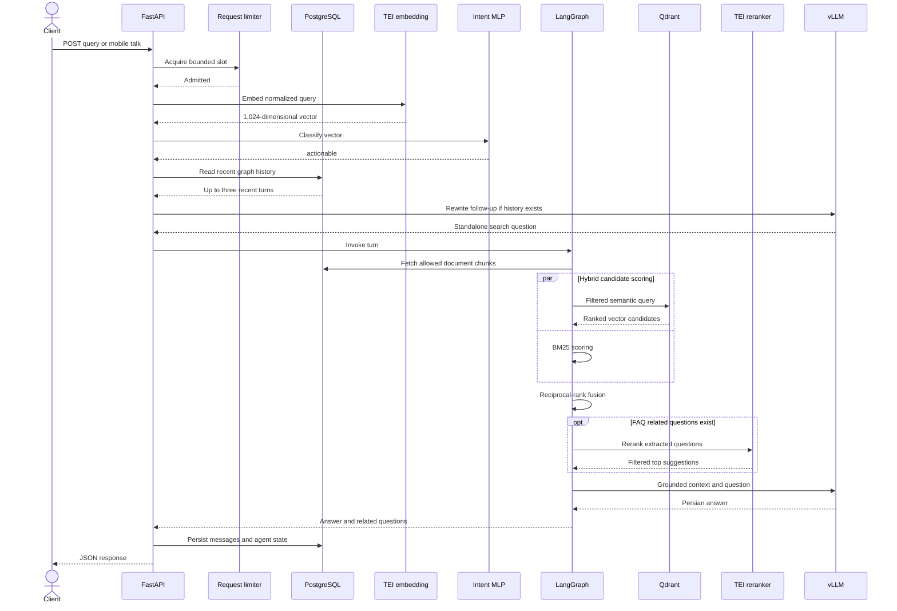

<div align="center">

# RagBot

### Production-oriented Agentic RAG chatbot for Persian neo-banking applications

[](#installation)
[](#api)
[](#architecture)
[](#technology-stack)
[](#technology-stack)
[](#performance)

RagBot combines Persian-language intent routing, session-aware query rewriting,
hybrid retrieval, and externally served inference behind FastAPI. It is designed
for banking FAQ and document workflows where bounded concurrency, predictable
timeouts, persistent conversation state, and reproducible staging evidence are
as important as answer generation.

[Overview](#overview) · [Architecture](#architecture) · [Features](#features) ·
[Performance](#performance) · [Installation](#installation) ·
[Configuration](#configuration) · [API](#api) · [Mass answer](#mass-answer) ·
[Load testing](#load-testing) · [Intent classifier](#intent-classifier) ·
[Testing](#development-and-testing) · [Documentation](#documentation) ·
[Contributing](#contributing) · [License](#license)

</div>

> [!IMPORTANT]
> This repository is production-oriented, but its checked-in deployment
> surface is incomplete: there is no Python dependency lockfile, Dockerfile,
> Compose file, Kubernetes manifest, or service-manager definition. vLLM and
> TEI are externally managed. Follow an approved deployment runbook and never
> treat the examples below as authorization to change production.

## Overview

The FastAPI application is designed to handle bounded concurrent production
workloads and serves web, mobile, knowledge-base, analytics, OCR
(when its optional service is installed), and batch-answering routes. A shared
`AnsweringService` normalizes and classifies each question before invoking a
LangGraph state machine. Online channels keep chat and graph state in
PostgreSQL; mass-answer rows use isolated, stateless graph runs.

A normal banking question follows this verified path:

1. A web or mobile request enters FastAPI and waits for a per-process request
   limiter slot.
2. Persian text is normalized, embedded by the TEI embedding service, and
   classified by the local PyTorch intent MLP as actionable or chit-chat.
3. Non-chit-chat online questions may be rewritten by the vLLM-served model
   using up to three recent conversation turns from PostgreSQL-backed state.
4. LangGraph routes chit-chat directly to generation and actionable questions
   to the RAG path.
5. PostgreSQL supplies document chunks; BM25 scores them locally while TEI
   embeds the query and Qdrant performs filtered semantic search.
6. Reciprocal-rank fusion combines BM25 and semantic candidates and returns the
   configured top results.
7. For FAQ responses, up to five extracted related questions are optionally
   reranked by the TEI reranker. The main retrieved context is **not** reranked.
8. The selected context and recent graph history are sent to the
   OpenAI-compatible vLLM endpoint.
9. The answer, related questions, and feedback flag are returned; online
   messages and agent state are persisted in PostgreSQL.
10. MinIO stores source objects during ingestion and is checked at application
    startup; it is not read in the verified online answer hot path.

## Features

- LangGraph-based agent orchestration with actionable/chit-chat routing
- Persian text normalization and Persian banking prompts
- Session-aware follow-up rewriting through the generative model
- Hybrid BM25 and Qdrant semantic retrieval with reciprocal-rank fusion
- Jina query embeddings served asynchronously by Hugging Face TEI
- TEI reranking of FAQ related-question suggestions
- Shared persistent `httpx` clients with bounded connection pools
- Per-process request admission control and a maximum 50-second API deadline
- PostgreSQL users, sessions, messages, document chunks, feedback, and job data
- Qdrant cosine-vector search with an active 1,024-dimensional policy
- MinIO-backed source-object ingestion
- Web and mobile APIs with session-aware history
- CSV/XLSX mass answering with bounded workers, per-row errors, and job mode
- Staging-only asynchronous mobile load generator and preserved artifacts
- Secret-safe environment validation

## Technology stack

| Layer | Verified technology | Role |
|---|---|---|
| API | Python 3.12, FastAPI, Pydantic, Uvicorn | HTTP gateway, schemas, lifespan |
| Agent | LangGraph | Per-turn state graph and routing |
| Generation | vLLM, OpenAI Python client | OpenAI-compatible rewrite and answer generation |
| Embedding/reranking | Hugging Face TEI 1.9.3, `httpx` | Asynchronous model-service calls |
| Intent | PyTorch, NumPy | Local two-class MLP over TEI embeddings |
| Retrieval | Qdrant, `rank_bm25`, Parsivar | Semantic search, BM25, Persian processing |
| Persistence | PostgreSQL, psycopg2 | Relational, document-chunk, chat, and job state |
| Objects | MinIO | Ingested source files |
| Data/batch | pandas, openpyxl | CSV/XLSX parsing and result generation |
| Serving hardware | NVIDIA CUDA | Shared staging inference GPU runtime |
| Containers | Docker (external services) | Observed TEI/vLLM service deployment; no repo-owned image definitions |

### Served models

| Component | Verified identifier | Role and control plane |
|---|---|---|
| Generative model | OpenAI served name `/app/model` | Used for query rewriting, chit-chat, and grounded answers. The underlying checkpoint identifier is **not captured** by the current repository artifacts; `LLM_MODEL` does not select the external vLLM model. |
| Embedding | `/app/models/models--jinaai--jina-embeddings-v5-text-small-retrieval` | Jina retrieval embeddings through TEI. Query calls use `prompt_name="query"`; stored documents use normalized raw text. |
| Reranker | `/app/models/BAAI--bge-reranker-v2-m3` | BGE reranking through TEI for FAQ related-question candidates. |
| Intent artifact | Local-only `chitchat_guardrail.pt` | PyTorch `1024 → 512 → 128 → 32 → 2` MLP mapping TEI embeddings to actionable or chit-chat; provision an approved checkpoint locally before serving. |

The active application selects model services by `VLLM_URL`, `TEI_EMBED_URL`,
and `TEI_RERANK_URL`. The `EMBEDDING_MODEL`, `LLM_MODEL`, and `RERANKER_MODEL`
environment entries are legacy metadata on this path; external startup
commands choose the actual TEI and vLLM models.

## Architecture

```mermaid
flowchart LR
    C[Web or mobile client] --> F[FastAPI gateway]
    F --> L[Per-process request limiter]
    L --> A[AnsweringService]
    A --> N[Persian normalization]
    N --> E[TEI embedding]
    E --> I[PyTorch intent classifier]
    I -->|chit-chat| G[LangGraph agent]
    I -->|actionable| H[PostgreSQL history]
    H --> W[vLLM query rewriting]
    W --> G
    G -->|general route| R[Hybrid retrieval]
    G -->|chit-chat route| V[vLLM generation]
    R --> B[BM25 over PostgreSQL chunks]
    R --> E
    R --> Q[Qdrant semantic search]
    B --> X[Reciprocal-rank fusion]
    Q --> X
    X --> K[Context and related candidates]
    K --> T[TEI reranker for FAQ related questions]
    K --> V
    T --> O[Response assembly]
    V --> O
    O --> P[PostgreSQL messages and state]
    O --> C
    M[MinIO source objects] -. ingestion and startup .-> F
    M -. ingestion .-> B
```



### Normal banking-query sequence



### Repository structure

```text
.
├── main.py                         # FastAPI app, lifespan, web and batch routes
├── mobile_api.py                   # /api/mobile gateway routes
├── answering_service.py            # Shared web/mobile/batch semantic path
├── agent_graph.py                  # LangGraph state, nodes, and routing
├── agent_service.py                # Stateful/stateless graph invocation
├── intent_classifier.py            # PyTorch actionable/chit-chat classifier
├── chitchat_guardrail.pt           # Local-only active checkpoint; not committed
├── mass_answer_*.py                # File, job, and bounded row processing
├── utils/                           # RAG, hybrid search, TEI clients, limits
├── new_architecture/                # Configuration, DB services, setup/insertion
├── benchmarks/                      # Load, embedding, batch tools and artifacts
├── tests/                           # Backend unit and benchmark tests
├── docs/                            # Architecture, configuration, performance
├── scripts/validate_environment.py # Secret-safe environment validator
└── .agents/skills/                  # Repository-local Codex skill definitions
```

## Performance

> **Passed the defined staging acceptance test.** This is evidence for the
> measured topology and workload—not a claim that the system is universally or
> fully optimized.

The accepted run used one FastAPI worker and one NVIDIA RTX 5880 Ada
Generation GPU (48 GB), with vLLM 0.26.0 and two TEI 1.9.3 services sharing the
staging GPU. It sent synthetic Persian banking FAQ traffic to
`POST /api/mobile/v1/talk` in five synchronized burst waves.

| Measurement | Accepted result |
|---|---:|
| Concurrent requests per wave | 50 |
| Repeated waves | 5 |
| Total measured requests | 250 |
| Successful requests | 250 / 250 (100%) |
| p50 latency | 14.38 s |
| p95 latency | **18.61 s** |
| p99 latency | 18.73 s |
| Maximum latency | **19.28 s** |
| Throughput | 3.05 requests/s |
| Limiter rejections | 0 |
| Application/client timeouts | 0 / 0 |
| HTTP 5xx | 0 |

The winning application configuration was:

```dotenv
REQUEST_CONCURRENCY_LIMIT=50
TEI_HTTP_MAX_CONNECTIONS=64
VLLM_HTTP_MAX_CONNECTIONS=64
REQUEST_ADMISSION_TIMEOUT_SECONDS=12
```

The server-side configuration held constant at vLLM
`tensor_parallel_size=1`, `max_model_len=4000`, `max_num_seqs=100`, GPU memory
utilization `0.75`, FP8 KV cache, and prefix caching; each TEI service used
`max_concurrent_requests=100`, `max_client_batch_size=50`, float16, automatic
truncation, and a 16,384-token batch ceiling.

Queries, identities, and answers were synthetic test traffic, but the endpoint
created persistent staging records. Schema and non-empty-answer checks passed;
there is no automated semantic answer-quality suite, so semantic correctness
was not independently certified. These single-RTX-5880 results do **not**
automatically transfer to the production topology of two separate NVIDIA L4
24 GB GPUs.

See the [final recommendation](docs/configuration/RTX5880_FINAL_RECOMMENDATIONS.md)
and [accepted run report](benchmarks/results/mobile-talk/rtx5880_request50_pool64_c50_20260729T125100Z/report.md).

## Installation

### 1. Prerequisites

- Linux with Python 3.12; the documented project interpreter is
  `/root/miniconda3/envs/faq/bin/python3.12`
- PostgreSQL, Qdrant, and MinIO reachable from the application
- NVIDIA driver/CUDA-compatible GPU runtime for externally served models
- Externally managed TEI embedding and reranking services
- An externally managed OpenAI-compatible vLLM service
- `curl`; Docker only if your approved service runbook uses the observed
  container deployment

> [!CAUTION]
> Do not run setup, insertion, or load commands against production. Database
> setup creates structures and sample data; insertion writes PostgreSQL,
> Qdrant, and MinIO; mobile load tests create users, sessions, and messages.

### 2. Clone and create an environment

```bash
git clone REPOSITORY_URL faq
cd faq
python3.12 -m venv .venv
source .venv/bin/activate
python -m pip install --upgrade pip
```

### 3. Install dependencies

The repository currently has no `pyproject.toml`, requirements file, Conda
environment file, or canonical Python installation command. Do not guess a
production dependency set from imports. Obtain the approved environment from
the maintainer, then verify it with:

```bash
python -c "import asyncpg, bcrypt, dotenv, fastapi, httpx, langgraph, minio, numpy, openai, openpyxl, pandas, parsivar, psycopg2, qdrant_client, rank_bm25, sqlalchemy, torch, uvicorn"
```

This gap prevents a clean-room beginner installation from being fully
reproducible today. Adding a pinned dependency manifest is the highest-priority
setup follow-up.

### 4. Create `.env`

```bash
test -e .env || cp .env.example.generated .env
chmod 600 .env
python3 scripts/validate_environment.py --env-file .env --mode staging --format text
```

Edit placeholders locally; never commit `.env`. Read the
[environment quick start](docs/configuration/ENVIRONMENT_QUICK_START.md) and
[complete variable reference](docs/configuration/ENVIRONMENT_VARIABLES.md).

### 5. Start required services

This repository contains **no current startup definition** for PostgreSQL,
Qdrant, MinIO, TEI, or vLLM. Start each service with the approved external
runbook and verify its address matches `.env`:

| Order | Service | Repository-verified requirement |
|---:|---|---|
| 1 | PostgreSQL | Target `POSTGRES_*`; admin `DEFAULT_DB_*` only for setup |
| 2 | Qdrant | Cosine collection, 1,024 dimensions, configured collection name |
| 3 | MinIO | Reachable endpoint and configured bucket/credentials |
| 4 | TEI embedding | Jina model above; host port 7997 in documented staging |
| 5 | TEI reranker | BGE model above; host port 7998 in documented staging |
| 6 | vLLM | OpenAI-compatible `/v1`; exact underlying model must be operator-confirmed |

The observed TEI commands and safe recreation/rollback pattern are documented
in the [model-server baseline](docs/configuration/RTX5880_MODEL_SERVER_BASELINE.md).
That document is evidence, not an instruction to recreate running containers.
No verified vLLM startup command or current underlying checkpoint identifier
exists in the repository.

Verify already-running non-production services without changing them:

```bash
curl -fsS --max-time 3 http://127.0.0.1:7997/health
curl -fsS --max-time 3 http://127.0.0.1:7998/health
curl -fsS --max-time 3 http://127.0.0.1:8000/health
```

Qdrant connectivity is verified by FastAPI startup when it lists or creates
the configured collection; the repository does not define a separate
non-mutating Qdrant health command for arbitrary deployments.

### 6. Database setup and knowledge insertion

<details>
<summary><strong>State-changing commands—review and run only in an approved empty non-production environment</strong></summary>

`setup_dbs.py` creates the target database and tables and then inserts sample
relational data. It expects execution from `new_architecture/` so its `app`
imports resolve:

```bash
cd new_architecture
python setup_dbs.py
cd ..
```

The insertion tool expects `DATA_INSERTION_DIRECTORY` to contain `DOCUMENTS/`
and `CHUNKS/`. It asks for an explicit `yes` before writing source objects,
relational metadata, chunks, and TEI-produced embeddings:

```bash
python new_architecture/insert_data.py
```

Review the target variables, input directory, generated users/collections, and
every file before confirming. The alternative
`new_architecture/data_insertion_with_api.py` has the same external write
footprint and is not the primary documented command.

</details>

### 7. Start FastAPI and verify health

The repository-defined entry point is:

```bash
python main.py
```

It loads `main:app`, defaults to `0.0.0.0:8080`, and runs without reload. For
the documented project environment, an equivalent explicit one-worker command
used by repository reports is:

```bash
/root/miniconda3/envs/faq/bin/python3.12 -m uvicorn main:app \
  --host 0.0.0.0 --port 7000 --workers 1
```

```bash
curl -fsS http://127.0.0.1:8080/api/health
```

`status=healthy` means the application lifespan completed; inspect
`system_initialized` as well. The route does not actively probe every
downstream service on each request.

## Configuration

Use `.env.example.generated` as the complete secret-free template. The shorter
example below shows groups, not a drop-in production configuration:

```dotenv
# FastAPI
API_HOST=127.0.0.1
API_PORT=8080
APPLICATION_REQUEST_TIMEOUT_SECONDS=50
REQUEST_CONCURRENCY_LIMIT=50
REQUEST_ADMISSION_TIMEOUT_SECONDS=12
BLOCKING_CONCURRENCY_LIMIT=16

# PostgreSQL
POSTGRES_HOST=localhost
POSTGRES_PORT=5432
POSTGRES_DB=ragbot
POSTGRES_USER=<secret-store-user>
POSTGRES_PASSWORD=<secret-store-password>

# Qdrant and MinIO
QDRANT_HOST=localhost
QDRANT_PORT=6333
QDRANT_COLLECTION=hihelp_embeddings
QDRANT_VECTOR_SIZE=1024
QDRANT_HTTPS=false
MINIO_ENDPOINT=localhost:9000
MINIO_ACCESS_KEY=<secret-store-access-key>
MINIO_SECRET_KEY=<secret-store-secret-key>
MINIO_BUCKET=ragbot-documents

# Externally managed inference URLs
VLLM_URL=http://127.0.0.1:8000/v1
TEI_EMBED_URL=http://127.0.0.1:7997
TEI_RERANK_URL=http://127.0.0.1:7998
TEI_HTTP_MAX_CONNECTIONS=64
VLLM_HTTP_MAX_CONNECTIONS=64

# Retrieval and generation
QDRANT_CONCURRENCY=8
RAG_RETRIEVAL_TOP_K=10
RAG_SEMANTIC_CANDIDATE_LIMIT=50
RAG_RELATED_QUESTIONS_RERANK_THRESHOLD=0.1
RAG_MAX_NEW_TOKENS=500
RAG_CHITCHAT_MAX_NEW_TOKENS=128
RAG_REWRITE_MAX_TOKENS=200
```

Environment values are read at import/startup. Restart every FastAPI worker
after application-side changes. See:

- [Beginner environment quick start](docs/configuration/ENVIRONMENT_QUICK_START.md)
- [Environment variable reference](docs/configuration/ENVIRONMENT_VARIABLES.md)
- [Environment audit](docs/configuration/ENVIRONMENT_AUDIT.md)
- [Secret-free RTX 5880 overlay](.env.recommended.rtx5880-staging)

## API

The tables below describe direct FastAPI routes. None of these routes declares
a FastAPI authentication dependency in the current source. A reverse proxy or
gateway may impose authentication, and deployments should not expose
state-changing routes anonymously.

### Endpoint summary

| Method and route | Purpose | Direct-route auth | Timeout behavior |
|---|---|---|---|
| `POST /api/mobile/v1/talk` | Session-aware mobile answer | None in app; gateway token may be required | 50 s total, including limiter wait; 503 busy, 504 deadline |
| `POST /api/query` | Session-aware web answer | None on route | Admission wait up to configured value; then 50 s operation deadline |
| `POST /api/mass-answer` | Direct or queued CSV/XLSX answers | None on route | No whole-file 50 s limit; per-row default 50 s |
| `GET /api/mass-answer/jobs/{job_id}` | Poll job progress and metrics | None on route | Normal request; no AI-operation wrapper |
| `GET /api/mass-answer/jobs/{job_id}/result` | Download completed output | None on route | `409` until complete; `410` after artifact expiry |
| `DELETE /api/mass-answer/jobs/{job_id}` | Cancel/delete a job | None on route | Cancels only an active task in this process |
| `POST /api/mass-answer/jobs/cleanup` | Remove expired inactive jobs | None on route | Filesystem/PostgreSQL work; state-changing |
| `GET /api/health` | Report application initialization state | None | No downstream active-probe deadline |

### Mobile talk

Request fields are `session_id`, `query`, and `national_code`; `documents`
defaults to `["General_FAQ"]`. The endpoint can create a user and session, then
persists the conversation.

```bash
curl --fail-with-body \
  -H 'Content-Type: application/json' \
  -H 'Authorization: Bearer <gateway-auth-token>' \
  -X POST http://127.0.0.1:8080/api/mobile/v1/talk \
  -d '{
    "session_id": "<session-uuid>",
    "national_code": "<synthetic-national-code>",
    "query": "چگونه رمز عبورم را بازیابی کنم؟",
    "documents": ["General_FAQ"]
  }'
```

The application route itself ignores the bearer header; it is shown as a safe
gateway placeholder. Minimal response:

```json
{
  "query_id": "<query-id>",
  "session_id": "<session-uuid>",
  "query": "چگونه رمز عبورم را بازیابی کنم؟",
  "answer": "<Persian answer grounded in the selected documents>",
  "related_questions": [],
  "feedback_needed": true
}
```

### Web query

`session_id` must identify an existing internal session because history and
graph state are enabled. The route accepts optional `documents`, `top_k`,
`alpha`, and `uploaded_text`, but the current shared answer call consumes only
the query, session, and selected documents; do not assume the other fields tune
active retrieval.

```bash
curl --fail-with-body \
  -H 'Content-Type: application/json' \
  -X POST http://127.0.0.1:8080/api/query \
  -d '{
    "query": "سقف انتقال وجه چقدر است؟",
    "documents": ["General_FAQ"],
    "session_id": 42
  }'
```

```json
{
  "status": "success",
  "query": "سقف انتقال وجه چقدر است؟",
  "answer": "<Persian answer>",
  "query_id": 314,
  "related_questions": [],
  "feedback_needed": true
}
```

### Health

```bash
curl -fsS http://127.0.0.1:8080/api/health
```

```json
{
  "status": "healthy",
  "system_initialized": true,
  "documents_available": 1,
  "ocr_available": false
}
```

FastAPI also exposes session, feedback, analytics, OCR, document, and
knowledge-base routes. Consult the generated OpenAPI document at `/docs` on an
authorized deployment and verify deployment-specific gateway paths before
integration.

## Mass answer

`POST /api/mass-answer` accepts multipart `.csv` and `.xlsx` files. CSV must be
UTF-8 or UTF-8 with BOM; `.xls` is rejected. Exactly one question column is
required, using one of `question`, `query`, `سوال`, `سؤال`, or `پرسش` after
normalization. Every other input column is optional and preserved. A
`selected_docs` JSON list applies to all rows.

| Input | Example |
|---|---|
| Required question column | `question` |
| Optional preserved columns | `category`, `reference` |
| Accepted files | `.csv`, `.xlsx` |
| Default maximum upload/rows | 10 MB / 5,000 rows |
| Direct mode | At most 20 rows by default; response is the result file |
| Job mode | More than 20 rows; HTTP 202 with status/result URLs |
| Row concurrency/deadline | 4 workers / 50 s per row by default |

Input:

| question | category |
|---|---|
| چگونه کارت جدید درخواست کنم؟ | کارت |
|  | تسهیلات |

Output appends these columns while preserving input order:

| question | category | Answer (پاسخ) | status | error_code | processing_time_ms | intent |
|---|---|---|---|---|---:|---|
| چگونه کارت جدید درخواست کنم؟ | کارت | `<answer>` | success |  | 8421.5 | general |
|  | تسهیلات |  | invalid_input | empty_query | 0.1 |  |

The full output also includes `error_message`, `rewritten_query`, and
`related_questions` JSON text. Errors are isolated per row; rows retain their
position. Batch rows do not use history and do not create chat sessions.

Direct example:

```bash
curl --fail-with-body \
  -F 'file=@tests/fixtures/mass_answer/sample_persian.csv;type=text/csv' \
  -F 'selected_docs=["General_FAQ"]' \
  http://127.0.0.1:8080/api/mass-answer \
  -o answered.csv
```

Job-mode response and polling:

```json
{
  "job_id": "<job-uuid>",
  "status": "queued",
  "total_rows": 100,
  "status_url": "/api/mass-answer/jobs/<job-uuid>",
  "result_url": "/api/mass-answer/jobs/<job-uuid>/result"
}
```

```bash
curl --fail-with-body http://127.0.0.1:8080/api/mass-answer/jobs/JOB_ID
curl --fail-with-body \
  http://127.0.0.1:8080/api/mass-answer/jobs/JOB_ID/result \
  -o answered.xlsx
```

A poll response includes progress and exposes `result_url` only after
completion:

```json
{
  "job_id": "<job-uuid>",
  "status": "running",
  "total_rows": 100,
  "completed_rows": 24,
  "successful_rows": 23,
  "failed_rows": 1,
  "timed_out_rows": 0,
  "queued_rows": 72,
  "active_rows": 4,
  "result_url": null
}
```

`GET .../result` returns the completed CSV/XLSX file. Deletion and expired-job
cleanup return, respectively:

```json
{"status": "deleted", "job_id": "<job-uuid>"}
```

```json
{"status": "success", "removed_jobs": 3}
```

Jobs run in tracked in-process tasks with PostgreSQL metadata and temporary
filesystem artifacts—not an external durable queue. A process restart can
interrupt a job and does not resume it. Large files therefore do not promise
completion within a normal 50-second interactive request. See the
[mass-answer architecture and operator guide](docs/architecture/MASS_ANSWER.md).

## Load testing

`benchmarks/load/mobile_talk_load_test.py` is a staging-only asynchronous
`httpx` runner with burst, closed-loop, and arrival-rate modes. It sends no
retries and reuses one client. These examples are state-changing and require
operator-reserved synthetic identities plus a reviewed cleanup plan.

<details>
<summary><strong>Smoke, 30-concurrent, and repeated 50-concurrent examples</strong></summary>

Smoke test:

```bash
python3 benchmarks/load/mobile_talk_load_test.py \
  --base-url https://ragbot-staging.example \
  --endpoint /v1/talk \
  --concurrency 1 --repetitions 1 \
  --scenario banking-smoke \
  --input-file benchmarks/load/fixtures/staging_synthetic_identities.json \
  --scenario-file benchmarks/load/fixtures/persian_banking_scenarios.json \
  --max-connections 1 --max-keepalive-connections 1 \
  --cleanup
```

One 30-request burst:

```bash
python3 benchmarks/load/mobile_talk_load_test.py \
  --base-url https://ragbot-staging.example \
  --endpoint /v1/talk \
  --workload-mode burst \
  --concurrency 30 --repetitions 1 \
  --scenario banking-faq \
  --input-file benchmarks/load/fixtures/staging_synthetic_identities.json \
  --scenario-file benchmarks/load/fixtures/persian_banking_scenarios.json \
  --request-timeout 55 \
  --max-connections 30 --max-keepalive-connections 30 \
  --cleanup
```

Five repeated waves of 50, matching the accepted workload shape:

```bash
python3 benchmarks/load/mobile_talk_load_test.py \
  --base-url https://ragbot-staging.example \
  --endpoint /v1/talk \
  --workload-mode burst \
  --concurrency 50 --repetitions 5 \
  --scenario banking-faq \
  --input-file benchmarks/load/fixtures/staging_synthetic_identities.json \
  --scenario-file benchmarks/load/fixtures/persian_banking_scenarios.json \
  --seed 20260728 --request-timeout 55 \
  --acquire-start-delay 0.05 \
  --max-connections 50 --max-keepalive-connections 50 \
  --strict --cleanup
```

</details>

Artifacts default to `benchmarks/results/mobile-talk/<run-id>/` and include
`summary.json`, `report.md`, `requests.csv`, `requests.jsonl`,
`interactions.md`, and a cleanup manifest when requested. The current runner
records full synthetic query text, answers, session IDs, and fixture national
codes. Authentication values are omitted. Review artifacts before sharing.

- **p50**: median successful latency
- **p95/p99**: tail latency below which 95%/99% of successful requests fall
- **maximum**: slowest successful response
- **throughput**: completed attempts divided by wall-clock run duration; it is
  not the configured concurrency

Never run this tool against production. `--cleanup` writes a manifest only; it
does not delete database records. Read the full
[load-test manual](benchmarks/load/README.md) and
[prerequisites](docs/performance/06-load-test-prerequisites.md) first.

## Intent classifier

The active classifier is a local PyTorch MLP loaded from
`chitchat_guardrail.pt`. The public repository intentionally excludes that
checkpoint because provenance, licensing, training-data review, and retraining
metadata are unavailable. Provision an approved local copy before serving. It
receives a 1,024-dimensional TEI query embedding,
runs inference under a lock outside the event loop, and returns `general` or
`chitchat`. Missing checkpoints are reported at startup, but the code continues
with randomly initialized, unvalidated weights; despite the current log text,
it does not explicitly force every query to the RAG route.

### Training lifecycle status

| Stage | What is verified in this repository |
|---|---|
| Dataset audit | No classifier dataset-audit command or report is present. |
| Embedding generation | Runtime embeddings come from TEI with `prompt_name="query"`; the benchmark utility can compare TEI with local Sentence Transformers, but it is not a classifier training pipeline. |
| Candidate training | No training script is present. `intent_classifier.py` references a missing `chitchat_guardrail.py`. |
| Candidate evaluation/selection | No classifier evaluation command, candidate report, threshold report, or selection manifest is present. |
| Activation | Startup loads the fixed root path `chitchat_guardrail.pt`; there is no versioned activation command or model registry. |
| Rollback | No automated rollback exists. A maintainer must restore a previously validated artifact and restart FastAPI through the approved runbook. |

Do not retrain, replace, or activate the artifact without a frozen dataset,
candidate metrics, retrieval tests, answer-quality tests, and a recoverable
versioned checkpoint. The current implementation uses TEI—not Sentence
Transformers—on the active runtime path.

The related embedding policy is documented in
[TEI embedding policy implementation](docs/performance/09-tei-embedding-policy-implementation.md)
and [query-task equivalence study](docs/performance/08-tei-query-task-equivalence.md).

## Development and testing

Use the approved Python 3.12 environment. The commands below exist in the
repository; they do not contact production unless an explicit live endpoint is
provided.

| Check | Verified command |
|---|---|
| Syntax | `python3 -m compileall -q main.py mobile_api.py agent_graph.py agent_service.py answering_service.py intent_classifier.py mass_answer_files.py mass_answer_jobs.py mass_answer_service.py utils new_architecture benchmarks tests scripts` |
| Backend unittest-compatible suite | `/root/miniconda3/envs/faq/bin/python3.12 -m unittest tests/test_*.py tests/benchmarks/test_mobile_talk_load_test.py` |
| Environment validation | `python3 scripts/validate_environment.py --env-file .env --mode staging --format text` |
| Environment validator tests | `python3 -m unittest tests.test_validate_environment -v` |
| Load-tool tests | `python3 -m unittest -v tests.benchmarks.test_mobile_talk_load_test` |
| Embedding-policy tests | `python3 -m unittest tests.test_tei_embedding_policy -v` |
| Retrieval/embedding evaluation | `python3 benchmarks/embedding/tei_query_task_equivalence.py --help` |
| TEI live policy smoke | `python3 benchmarks/embedding/verify_tei_embedding_policy.py --tei-url http://127.0.0.1:7997` |
| Synthetic batch scheduler | `python3 benchmarks/mass_answer_benchmark.py` |
| Staging mobile load test | `python3 benchmarks/load/mobile_talk_load_test.py --help` |
| Bundled Qdrant UI tests | `(cd qdrant-web-ui-master && npm test)` and `(cd static_qdrant && npm test)` |

There is no configured repository-wide lint command, type-check command,
Markdown-lint command, intent-classifier evaluation command, or automated
semantic answer-quality command. Full `unittest discover` also collects
`tests/benchmarks/test_tei_query_task_equivalence.py`, which imports unavailable
`pytest` in the documented environment. Use the unittest-compatible command
above; use full discovery only after the approved environment adds pytest.

## Operations

- Keep one FastAPI worker until multi-worker capacity is benchmarked. Each
  worker creates its own request limiter and outbound connection pools.
- Treat `REQUEST_CONCURRENCY_LIMIT` as per worker, not host-wide capacity.
- Restart every FastAPI worker after `.env` changes; settings are read at
  import/startup.
- Preserve the lifespan-owned TEI/vLLM `httpx` clients; per-request clients
  would discard the measured connection-pool behavior.
- Check FastAPI, vLLM, TEI embedding, and TEI reranking health independently.
- Keep staging and production credentials, data, endpoints, and hardware
  separate. Retest the dual-L4 topology before production conclusions.
- Reconcile cleanup manifests and remove synthetic records through an
  authorized staging procedure; the load tool never deletes them.
- Pin external Docker images to immutable digests rather than mutable tags.
- Do not log prompts, customer data, authentication values, or banking data.
  Existing application metrics are limited; add stage timing without content.
- Preserve layered deadlines: admission, total application, TEI/vLLM phase,
  Qdrant, and PostgreSQL timeouts protect different resources.
- Roll back one measured configuration change at a time and rerun the same
  benchmark. Model/prompt/retrieval changes also require quality gates.

## Troubleshooting

| Symptom | Verified check or resolution |
|---|---|
| TEI embedding unavailable | Check `TEI_EMBED_URL`, then `/health`; staging embedding is 7997. Restart FastAPI after URL changes. |
| TEI reranker unavailable | Check `TEI_RERANK_URL`, then `/health`; staging reranking is 7998. Do not swap the ports. |
| vLLM unavailable | Verify `VLLM_URL` includes `/v1`; check vLLM `/health` and `/v1/models`; confirm `/app/model` is served. |
| Qdrant connection failure | Validate split `QDRANT_HOST`, `QDRANT_PORT`, `QDRANT_HTTPS`, key policy, and collection; active code ignores `QDRANT_URL`. |
| PostgreSQL authentication failure | Validate `POSTGRES_*` without printing values; setup-only `DEFAULT_DB_*` does not override them. |
| MinIO startup failure | Confirm `MINIO_ENDPOINT` is `host:port`, bucket and credentials are present, and TLS matches the deployment. |
| Embedding dimension mismatch | Keep `QDRANT_VECTOR_SIZE=1024`; changing the model/vector policy requires a new compatible collection and quality evaluation. |
| Mass-answer request seems stuck | Files over the direct threshold use job mode; poll the returned status URL. Direct rows still have individual deadlines. |
| Limiter rejection / `SERVICE_BUSY` | Compare worker count and effective per-worker `REQUEST_CONCURRENCY_LIMIT`; inspect admission wait before raising capacity. |
| HTTP connection-pool timeout | Verify TEI/vLLM pool sizes and keep-alive limits. The accepted 50-request staging run required pools of 64. |
| Missing classifier artifact | Stop before serving traffic and restore the validated `chitchat_guardrail.pt`; the code otherwise uses unvalidated random weights. No training/download fallback or registry exists. Restart FastAPI. |
| `.env` changes not applied | Run the validator and restart every FastAPI worker; exported process variables override `.env`. |
| Repository skills not discovered by Codex | Start Codex at the repository root and confirm `.agents/skills/<skill>/SKILL.md` exists and is readable. |
| CUDA out of memory | Stop the test, capture GPU/process evidence, restore the last measured service configuration, and reduce one controlled capacity variable before retesting. |

## Documentation

- [README claim source map](docs/README_SOURCE_MAP.md)
- [Environment quick start](docs/configuration/ENVIRONMENT_QUICK_START.md)
- [Environment variable reference](docs/configuration/ENVIRONMENT_VARIABLES.md)
- [Environment audit](docs/configuration/ENVIRONMENT_AUDIT.md)
- [RTX 5880 final recommendations](docs/configuration/RTX5880_FINAL_RECOMMENDATIONS.md)
- [RTX 5880 model-server baseline](docs/configuration/RTX5880_MODEL_SERVER_BASELINE.md)
- [RTX 5880 experiment plan](docs/performance/10-rtx5880-configuration-experiment-plan.md)
- [TEI query-task equivalence](docs/performance/08-tei-query-task-equivalence.md)
- [TEI embedding policy](docs/performance/09-tei-embedding-policy-implementation.md)
- [Concurrency repair report](docs/performance/05-concurrency-repair-report.md)
- [Mass-answer architecture](docs/architecture/MASS_ANSWER.md)
- [Mass-answer repair report](docs/performance/17-mass-answer-repair-report.md)
- [Answering-path parity](docs/performance/18-answering-path-parity.md)
- [Mobile load-test manual](benchmarks/load/README.md)

No dedicated CPU/RAM optimization audit or intent-classifier architecture and
training report exists in the current repository.

## Contributing

No project-level `CONTRIBUTING.md` is present. A minimal contribution flow is:

1. Create a focused branch.
2. Make one coherent change and avoid unrelated formatting churn.
3. Add or update tests and documentation.
4. Run the relevant validation commands above; benchmark every performance
   change before and after.
5. Open a pull request that states scope, evidence, risks, and rollback.

Do not change model behavior without retrieval and answer-quality tests. Never
include credentials, real customer data, authentication values, or banking
records in commits, fixtures, logs, issues, or benchmark artifacts.

## Security

No project-level `SECURITY.md` is present. Do not open a public issue containing
credentials, internal service addresses, customer data, national identifiers,
or banking data. Use the repository owner's approved private reporting channel;
no public security contact is declared here.

## License

This repository currently has **no declared project-level license**. The
Apache-2.0 files inside the two bundled Qdrant UI directories apply to those
bundled components only and do not license RagBot as a whole. Until a project
license is added, do not assume permission to use, modify, or redistribute the
project beyond applicable law and explicit owner authorization.
