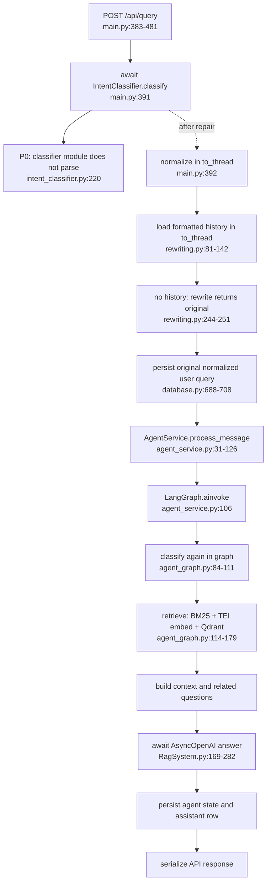
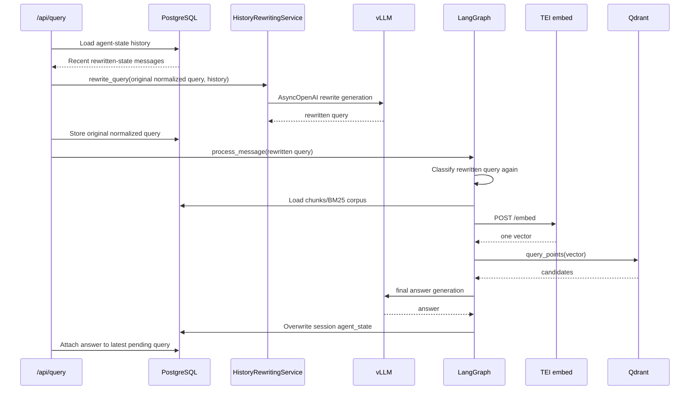
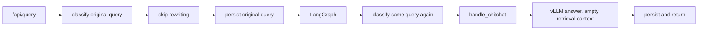
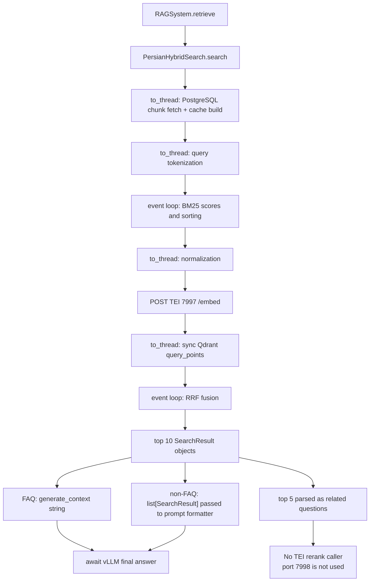

# TEI and async compatibility review

Review date: 2026-07-28

Repository revision: `d8111dc` on branch `storages`, with a heavily dirty worktree

Scope: review only; no application source, environment, schema, package, or container changes were made

## 1. Executive summary

The current worktree cannot start the FastAPI application. Four imported Python modules fail syntax parsing:

1. `utils/RagSystem.py:63` — unexpected indentation.
2. `new_architecture/app/services/history/rewriting.py:245` — missing function-body indentation.
3. `intent_classifier.py:220` — `await` in a synchronous function.
4. `agent_graph.py:198` — invalid `await answer = ...` syntax.

These are verified P0 defects. In the audit interpreter, `import main` also stops earlier at missing `pandas`; that is an environment/dependency failure, not proof that the staging runtime lacks the package.

The leaf TEI request shapes are mostly compatible with the captured TEI image:

- Both inspection artifacts identify TEI `cuda-1.9.3`, revision `06670157fb6c1523482219bdb2d1660277d38088`.
- `POST /embed` accepts either a string or a list in `inputs`; `normalize` is supported and defaults to `true`; the response is a batch-shaped list of vectors. Therefore the current string request and `response.json()[0]` are structurally valid.
- `POST /rerank` accepts `{"query": string, "texts": list[string]}`. TEI 1.9.3 returns `[{index, score}, ...]`, sorted by descending score. `index` refers to the original input position.

However, TEI reranking is not connected to the web or mobile request path. `PersianHybridSearch.rerank()` has no caller, `main.rerank_async()` is an orphan with an invalid `self` contract, and `reranker_model` remains `None` because local `CrossEncoder` construction is commented out. Related questions therefore remain in hybrid-retrieval order and do not use port 7998.

The attempted async migration is incomplete across every public AI caller:

- `/api/query` has mutually incompatible classifier calls: it awaits `classify()`, while the LangGraph classifier node does not.
- `/api/mobile/v1/talk` and `/api/mass-answer` call async APIs without `await`.
- `main.py`, `agent_service.py`, and `utils/persian_hybrid_search.py` use `asyncio` without importing it.
- `AgentService` compiles an already compiled graph.
- Blocking PostgreSQL calls remain directly on the event loop.
- There is no 50-second end-to-end deadline.
- TEI, vLLM, Qdrant, PostgreSQL, and startup clients are not fully closed.

There is also a verified same-session data-corruption race. Concurrent requests insert separate pending query rows, but assistant persistence selects “the latest pending” row rather than the row created by that request. Whole-session metadata is then overwritten without a revision check or lock. Replies can be attached to the wrong query and one agent-state update can erase another. This is P0 under the requested severity definition.

No performance improvement can be claimed from this review. No benchmark runner, retrieval-quality test, or answer-quality test exists in the repository, and no staging load was authorized or run.

## Audit contract and limitations

| Item | Verified value |
|---|---|
| Audit question | Compatibility of the TEI migration and attempted end-to-end async conversion |
| Primary endpoint/workload | `POST /api/query`; mobile and mass-answer callers checked for compatibility |
| Source revision | `d8111dc`; dirty worktree, so the hash does not uniquely identify reviewed contents |
| External deadline | 50 seconds |
| Staging hardware | One NVIDIA RTX 5880 Ada Generation GPU, 48 GB VRAM, per `AGENTS.md` |
| Production hardware | Two NVIDIA L4 GPUs, 24 GB each, per `AGENTS.md`; no production inference is made |
| TEI runtime artifacts | Embedding and reranker inspection JSON captured from TEI 1.9.3, both configured for GPU 0 |
| TEI models | Jina embedding path and `BAAI--bge-reranker-v2-m3`, from sanitized inspection artifacts |
| vLLM version and live configuration | Unknown; only the previous proposal describes a command |
| Running-service availability | TEI ports 7997/7998 refused connections from this audit environment |
| Test data/load | None; no request/load benchmark was run |
| Cold/warm state | Not applicable |
| Background workload/GPU contention | Unknown; not measured |
| Safe configuration fingerprints | `.env` SHA-256 `fec0de…dd64`; `.env.server_git` `4ac5eb…b8c`; contents not reproduced |

The runtime inspection artifacts state that the TEI containers were running when captured on 2026-07-27. They do not prove that the services were reachable during this review.

## 2. Verified request-flow diagrams

The application cannot execute these flows as written because imports fail. The diagrams below are static traces of the intended flow, with the first known failure and later latent defects shown explicitly.

### 2.1 Standalone general question



For a truly new session, rewriting should not call vLLM because the sentinel history returns the original query. The query is nevertheless classified twice.

### 2.2 Follow-up general question using chat history



History is not loaded only once. Before the final API response, the same session is read by history rewriting, `AgentService.get_session_by_id`, `AgentService.get_session_metadata`, and the final metadata read in `main.py`. The relational query row preserves the original normalized query, but `agent_state.messages` stores the rewritten query; subsequent rewriting therefore consumes rewritten history.

### 2.3 Chitchat



Chitchat correctly skips history rewriting and retrieval in the intended web path, but classification is duplicated. `agent_graph.py:198` prevents this node from parsing.

### 2.4 Retrieval, related questions, and final generation



Reranking does not affect answer context or related-question output because it is not invoked.

## 3. Function-level compatibility inventory

“Awaited” describes the immediate caller in the traced web path. Exceptions list explicit and material implicit failures; ordinary Python type/key/index errors remain possible where input is not validated.

| Function, file:lines | Caller → callee | Mode / awaited / return | Exceptions and timeout | Cancellation, client, thread, external resource |
|---|---|---|---|---|
| `query_documents`, `main.py:383-481` | FastAPI → classifier, normalizer, history, persistence, agent | Async route; downstream calls are partly awaited; returns dict | No route timeout; downstream errors become default 500 | Request cancellation reaches awaited coroutines, but `to_thread` work continues; mutates request query to normalized text |
| `IntentClassifier.classify`, `intent_classifier.py:201-238` | Route and graph → `_encode`, Torch MLP | Declared sync but contains `await`; no valid return at runtime | P0 syntax error | Intended local SentenceTransformer + local Torch/GPU; proposed offload is malformed |
| `PersianTextProcessor.normalize`, `persian_hybrid_search.py:77-89` | Route/search → Parsivar normalizer | Sync; web caller uses `to_thread`; returns string | Library exceptions propagate | Shared processor object is used from worker threads; thread-safety is unverified; CPU only |
| `get_formatted_history_string`, `rewriting.py:81-142` | Route → DB session read | Sync; web caller uses `to_thread`; returns string sentinel/history | `int()`/JSON errors may propagate; DB errors are swallowed below | Per-operation PostgreSQL connection; no connect/query timeout; worker-thread cancellation does not stop DB call |
| `rewrite_query`, `rewriting.py:244-251` | Route → `generate_text` | Intended async/await; returns string | P0 indentation error; vLLM errors propagate | Shared AsyncOpenAI; no total deadline |
| `generate_text`, `RagSystem.py:285-292` | Rewriter/summarizer → vLLM chat completion | Async and awaited only by repaired rewriter; returns string | OpenAI errors propagate; no explicit timeout/retry settings | Shared AsyncOpenAI; cancellation behavior delegated to SDK/httpx; GPU via vLLM |
| `ChatManager.add_message`, `database.py:688-708` | Route → session lookup, query/answer write | Sync; web caller uses `to_thread`; returns dict/None | `RuntimeError` only in title helpers; DB errors mostly become None | Multiple new psycopg2 connections per call; no pool; worker thread |
| `DatabaseManager._execute`, `database.py:41-70` | All DB manager methods → psycopg2 | Sync; returns bool/dict/list/None | Catches `psycopg2.Error`, rolls back, prints, returns sentinel | New connection and cursor per operation; closed in `finally`; no DB timeout; no shared cursor |
| `AgentService.process_message`, `agent_service.py:31-126` | Route → DB, graph, metadata write | Async and awaited by web route; returns string/None | `NameError` because `asyncio` is not imported; graph/DB conversion errors propagate | First session read and final write use thread pool; metadata read at line 52 blocks event loop |
| `build_graph`, `agent_graph.py:307-357` | AgentService constructor → LangGraph compile | Sync; returns a compiled graph | Compile depends on valid nodes | No external resource |
| `AgentService.__init__`, `agent_service.py:15-29` | Lifespan → `build_graph(...).compile()` | Sync | Likely `AttributeError`: compiles an already compiled graph | Per-process graph |
| `add_user_message` node, `agent_graph.py:64-73` | LangGraph → state mutation | Async node, awaited by `ainvoke`; returns same dict | Key/type errors | No await inside; mutates per-invocation state |
| `classify_intent` node, `agent_graph.py:84-111` | LangGraph → classifier | Async node but calls classifier without await; returns state | If classifier becomes async, result is coroutine and subscripting fails | Local classifier/GPU intended; currently incompatible |
| `handle_general` node, `agent_graph.py:114-179` | LangGraph → retrieve, context, answer | Async; awaits retrieve and answer; returns state | Downstream errors propagate | Logs retrieved context and history; TEI, PostgreSQL, Qdrant, vLLM |
| `handle_chitchat` node, `agent_graph.py:182-214` | LangGraph → answer | Intended async | P0 invalid syntax at line 198 | vLLM only; logs raw user query |
| `add_assistant_message` node, `agent_graph.py:272-287` | LangGraph → state mutation | Async node with no await; returns state | Key/type errors | No external resource |
| `RAGSystem.retrieve`, `RagSystem.py:107-109` | General node → search | Async/await; returns list of search results | Search errors propagate | Shared search engine |
| `PersianHybridSearch.search`, `persian_hybrid_search.py:369-418` | Retrieve → BM25 and semantic search | Async; returns `list[SearchResult]` | `ValueError` if no docs; KeyError on divergent IDs; missing `asyncio` causes NameError | Thread pool for corpus/tokenization/normalization; event loop for BM25 score/sort and RRF |
| `_get_or_build_bm25`, `persian_hybrid_search.py:348-354` | Search worker → chunk fetch/build | Sync in thread; returns cached tuple | DB/parser errors propagate or become empty corpus | Shared unbounded mutable cache; no lock or invalidation; shared text processor |
| `chunk_fetcher`, `rag_utils.py:44-50` | BM25 builder → DB chunks | Sync in enclosing worker; returns dict | DB errors become empty list | Per-operation PostgreSQL connection |
| `_build_temporary_bm25`, `persian_hybrid_search.py:308-321` | Cache builder → processor/BM25 | Sync in worker; returns BM25, IDs, texts | Missing text/key/library errors | CPU only; shares processor |
| `_encode_query`, `persian_hybrid_search.py:245-251` | Semantic search → TEI `/embed` | Async/await; returns first vector | HTTP status, connect/read/write/pool timeout, JSON/type/index errors | Shared HTTPX client; TEI/GPU; cancellation normally propagates |
| `_semantic_search`, `persian_hybrid_search.py:326-344` | Search → embed, Qdrant | Async; awaits both; returns score dict | Missing `asyncio`, TEI, Qdrant, payload errors | Shared sync Qdrant client invoked in worker thread |
| `QdrantClient.query_points`, called at `persian_hybrid_search.py:334-342` | Semantic search worker → Qdrant | Sync, correctly passed as callable to `to_thread` | Client errors; no application-configured timeout/retry | Shared per-process client; HTTP/gRPC behavior and thread safety need version/runtime confirmation |
| `generate_context`, `RagSystem.py:111-165` | General node → regex/XML formatting | Sync on event loop; returns string | Attribute/type errors | CPU only; expects SearchResult objects |
| `RAGSystem.answer`, `RagSystem.py:169-282` | General/chitchat node → vLLM | Async; chat completion awaited; returns cleaned string | P0 module indentation first; later `NameError` because `clean_llm_answer` is not imported; SDK errors | Shared AsyncOpenAI; vLLM/GPU; no explicit deadline |
| Related-question extraction, `agent_graph.py:138-155` | General node → regex parsing | Sync; returns list of dicts in state | Regex/content type errors | CPU only; first five hybrid results |
| `PersianHybridSearch.rerank`, `persian_hybrid_search.py:421-427` | No caller → TEI `/rerank` | Async; would return raw JSON list | HTTP/JSON errors; no schema checks | Shared HTTPX; TEI/GPU; never reached |
| Related-question response block, `main.py:437-470` | Route → optional local model | Sync on event loop; returns filtered local list | Local prediction errors propagate | `reranker_model` is always None in current startup, so block is dead |
| Final metadata/read response, `main.py:426-481` | Route → DB, serialization | Async route with DB in threads; returns dict | DB sentinels can lead to missing IDs/state | Per-operation DB connections |

### Other incompatible public callers

| Caller | Verified incompatibility |
|---|---|
| `mobile_api.gateway_talk`, `mobile_api.py:73-151` | Calls classifier, rewriting, and agent processing without await; all DB work runs directly on the event loop. A coroutine can be passed as persisted answer content. Broad `Exception` handling converts failures to a generic 500. |
| `main.process_mass_answer`, `main.py:740-851` | Calls rewriting, retrieve, and answer without await; passes unsupported `alpha` to `retrieve`; passes coroutine objects into context/cleaning; loops serially; pandas and file writes block the event loop. |
| `HistoryRewritingService.summarize_history`, `rewriting.py:35-54` | Calls async `generate_text` without await and returns a coroutine from a sync method. |
| Knowledge-base create/update/revert, `kb_manager.py:170-250`, `253-337`, `407-490` | Require removed `search_engine.query_encoder` and perform local `.encode()`. They currently return 503 after the TEI migration. |
| `EmbeddingService`, `new_architecture/app/services/embedding/embedding.py:29-96` | Still loads and runs SentenceTransformer locally; constructor erroneously passes `self.model` (`None`) instead of `self.model_name`. |
| Data insertion scripts, `new_architecture/insert_data.py:54,1075-1156` and `new_architecture/data_insertion_with_api.py:54,1078-1159` | Still load SentenceTransformer and run local passage embedding. These are offline scripts, not the web hot path, but they can generate embeddings with behavior that differs from TEI. |

## 4. Compatibility matrix

| Check | Result | Classification / severity | Evidence |
|---|---|---|---|
| Remaining SentenceTransformer load | Present in active classifier, embedding service, and insertion scripts | Verified defect / P1 for active startup; P3 elsewhere | `intent_classifier.py:28,119`; embedding and insertion ranges above |
| Remaining CrossEncoder load | Import remains; construction is commented out | Verified defect / P3 maintainability | `main.py:61-68,250-260` |
| Remaining local query embedding | Intended in classifier and KB routes; active code is broken | Verified defect / P1 | `intent_classifier.py:183-195`; `kb_manager.py:184-188,268-272,424-428` |
| Remaining local reranking | No active inference; dead local block remains | Verified defect / P3 | `main.py:443-461` |
| Embedding endpoint path | Correct for TEI 1.9.3 | Compatible | `persian_hybrid_search.py:245-249` |
| Reranking endpoint path | Correct, but unused | Verified defect / P1 | `persian_hybrid_search.py:421-427`; no caller |
| Embedding JSON body | Structurally correct | Compatible with runtime confirmation for model semantics | TEI 1.9.3 `EmbedRequest`; code sends `inputs` and `normalize` |
| Reranking JSON body | Structurally correct | Compatible | TEI 1.9.3 `RerankRequest` |
| String vs list for embedding | Both accepted | Compatible | TEI 1.9.3 `Input::Single` and `Input::Batch` |
| `normalize` supported | Yes; default true | Compatible | TEI 1.9.3 source |
| Embedding response parsing | Correct shape for valid response; unvalidated | Verified defect / P2 for malformed responses | `persian_hybrid_search.py:251` |
| Reranker response parsing | Raw JSON only; no validation or candidate mapping | Verified defect / P1 if connected | `persian_hybrid_search.py:427` |
| Reranker result ordering | TEI sorts descending | Compatible fact; application must still map by returned `index` | TEI 1.9.3 server source |
| Reranker index alignment | No implementation | Verified defect / P1 | No caller maps `rank["index"]` back to candidate list |
| Embedding/Qdrant dimensions | Stored Qdrant collection is 1024; actual TEI output not observed | Likely defect requiring runtime confirmation / P1 | `storage/collections/hihelp_embeddings/config.json`; TEI unreachable |
| Classifier dimensions | MLP expects 1024; actual classification embedding path is absent/broken | Verified defect / P1 | `intent_classifier.py:35,46-77,183-220` |
| Retrieval task semantics | Old `task="retrieval.query"` removed; no TEI `prompt_name` | Likely defect requiring quality confirmation / P2 | Commented old code `persian_hybrid_search.py:282-289`; current body `245-249` |
| TEI errors | HTTP status errors propagate; no stable API mapping, retry, or response validation | Verified defect / P2 | `_encode_query`, `rerank`, `/api/query` |
| Separate HTTP timeouts | Connect=3 s; read/write/pool all inherit 10 s; not independently budgeted | Verified defect / P2 | `persian_hybrid_search.py:238` |
| Shared HTTP client reuse | `_http` is reusable across tasks | Compatible in principle | One search engine per process |
| HTTP client closure | Never closed | Verified defect / P2 | No `aclose()` in lifespan |
| Default-argument HTTP client | Created at module import and never used/closed | Verified defect / P2 | `persian_hybrid_search.py:214` |
| Async function without await | Present in mobile, mass answer, summarizer, graph classifier depending on repair | Verified defect / P1 | Call-site table above |
| Sync function incorrectly awaited | Web route awaits currently sync `classify` | Verified defect / P1 | `main.py:391`, `intent_classifier.py:201` |
| `graph.invoke` vs `ainvoke` | Web service uses `ainvoke`, correctly | Compatible | `agent_service.py:106` |
| Async nodes through sync graph | `ainvoke` selected, but graph is double-compiled and nodes are invalid | Verified/likely startup defect / P0 | `agent_service.py:24-29`, `agent_graph.py` |
| Blocking DB in async path | Present | Verified defect / P2 | `agent_service.py:52`; all mobile path DB calls |
| Blocking Qdrant in async path | Offloaded in retrieval path | Compatible | `persian_hybrid_search.py:334-342` |
| Blocking filesystem/tokenizer/model | Tokenization mostly offloaded; scenarios file/startup and many other routes block; classifier invalid | Verified defect / P2 | Relevant ranges above |
| Incorrect `to_thread` | Classifier passes the result instead of callable | Verified defect / P1 | `intent_classifier.py:220` |
| Nested thread pools | None found in the traced path | Compatible |
| Thread-unsafe DB cursors shared | Main request manager uses per-operation connections; startup auth/analytics share one psycopg2 connection | Likely defect requiring concurrency confirmation / P2 | `connection.py:43-49`; `main.py:208,903-1134` |
| Locks held across await | No locks found | Compatible, but absence enables session races |
| Unbounded `gather` | No `asyncio.gather` found | Compatible |
| Fire-and-forget tasks | Only response cleanup via FastAPI BackgroundTasks; no AI fire-and-forget task | Compatible |
| Cancellation swallowed | `CancelledError` is not caught by current `except Exception` on modern Python; thread work still continues | Likely defect / P2 for post-cancel writes | `to_thread` persistence calls |
| New event loop / `asyncio.run` in request | None found | Compatible |
| Synchronous OpenAI client | None on current RAG path | Compatible | AsyncOpenAI import/construction |
| AsyncOpenAI call not awaited | Leaf calls are awaited; callers in mass/summarizer are not | Verified defect / P1 | `RagSystem.py:276,286`; caller table |
| Client created before event loop | Qdrant at import; unused HTTPX default at import; AsyncOpenAI at lifespan | Mixed / P2 | `main.py:92-98`; hybrid default; `main.py:220` |
| AsyncOpenAI closure | Never closed | Verified defect / P2 | Lifespan has no cleanup |
| Query rewriting order | Web classifies before rewrite, then graph classifies rewritten query again | Verified defect / P2 | `main.py:391-410`; `agent_graph.py:84-111` |
| History loaded more than once | Yes, at least four session/metadata reads on a follow-up | Verified defect / P3 | Flow trace |
| Original query replaced in history | Relational row keeps normalized original; agent state stores rewrite | Verified defect / P2 semantic divergence | `main.py:413,421`; `agent_graph.py:66-69` |
| Chitchat rewriting | Skipped in web path; mobile intends to skip | Compatible, but classifier duplicated |
| Removed `query_encoder` dependencies | Still present at startup and KB routes | Verified defect / P0 startup | `main.py:237-240`; KB ranges |
| Search/retrieve/context/answer signatures | Web graph leaf signatures mostly align; other callers do not | Verified defect / P1 | Call-site inventory |
| SearchResult vs string context | FAQ gets string; non-FAQ gets `list[SearchResult]` stringified into prompt | Likely correctness defect / P2 | `agent_graph.py:169`; `RagSystem.py:229-233` |
| Reranked results affect answer | No | Compatible only if intentionally separate |
| Reranked results affect related questions | No | Verified defect / P1 against stated requirement |
| TEI/vLLM exception API response | Default unstructured 500 on web; generic 500 on mobile | Verified defect / P2 | No handler for dependency exceptions |
| Total 50-second deadline | Absent | Verified defect / P1 | No `asyncio.timeout`, per-request deadline, or budget propagation |

TEI contract evidence: [TEI 1.9.3 request/response types](https://github.com/huggingface/text-embeddings-inference/blob/06670157fb6c1523482219bdb2d1660277d38088/router/src/http/types.rs) and [TEI 1.9.3 server sorting and routes](https://github.com/huggingface/text-embeddings-inference/blob/06670157fb6c1523482219bdb2d1660277d38088/router/src/http/server.rs).

## 5. Critical failures that prevent the application from running

### CF-1 — Four imported modules do not parse

- Classification: **Verified defect**
- Severity: **P0**
- Evidence: read-only `compile()` pass over 60 Python files failed exactly at:
  - `utils/RagSystem.py:63`
  - `new_architecture/app/services/history/rewriting.py:245`
  - `intent_classifier.py:220`
  - `agent_graph.py:198`
- Impact: FastAPI cannot import the application in an environment with dependencies installed.

### CF-2 — Removed `query_encoder` is still required by startup

- Classification: **Verified defect**
- Severity: **P0**
- Evidence: `PersianHybridSearch` no longer assigns `query_encoder` (`persian_hybrid_search.py:232-239`), while lifespan reads it at `main.py:237-240`.
- Impact: after syntax repairs, startup raises `AttributeError` before serving requests.

### CF-3 — Intent classifier constructor and async contract are internally inconsistent

- Classification: **Verified defect**
- Severity: **P0**
- Evidence:
  - `intent_classifier.py:119` references undefined `query_embedding_model`.
  - `_encode()` uses missing `self.embedding_model` at `189`.
  - `classify()` is sync but contains `await`.
  - Web awaits it (`main.py:391`); graph does not (`agent_graph.py:87`).
- Impact: no single minimal syntax edit makes both callers valid.

### CF-4 — Missing `asyncio` imports

- Classification: **Verified defect**
- Severity: **P0**
- Evidence: `main.py:392,404,413,426,431`, `agent_service.py:46,118,125`, and `persian_hybrid_search.py:334,377,382,387` use `asyncio`; none of those modules imports it.
- Impact: the first reached offload raises `NameError`.

### CF-5 — The graph is compiled twice

- Classification: **Likely defect requiring runtime confirmation**
- Severity: **P0**
- Evidence: `build_graph()` returns `graph.compile()` at `agent_graph.py:357`; `AgentService.__init__` then calls `.compile()` at `agent_service.py:24-29`.
- Impact: standard LangGraph compiled graphs do not require or expose a second compilation step. Exact failure depends on the unrecorded LangGraph version.

### CF-6 — RAG answer cleanup symbol is missing

- Classification: **Verified defect**
- Severity: **P1**
- Evidence: `utils/RagSystem.py:282` calls `clean_llm_answer`, but the module does not import it.
- Impact: a successful vLLM response fails before reaching the user.

### CF-7 — Audit environment cannot import application dependencies

- Classification: **Likely defect requiring runtime confirmation**
- Severity: **P1**
- Evidence: `python3 -c 'import main'` failed on missing `pandas`; package metadata also showed FastAPI, OpenAI, Qdrant, LangGraph, psycopg2, Torch, and others absent.
- Impact: this interpreter is not a runnable application environment. The repository provides no canonical Python dependency manifest, so reproducible setup cannot be validated.

## 6. Concurrency defects

### CD-1 — Same-session assistant/query misassociation and lost metadata updates

- Classification: **Verified defect**
- Severity: **P0**
- Evidence:
  - Each request inserts a pending query (`database.py:341-378`).
  - Assistant persistence selects the latest pending row (`database.py:465-478`), not the query ID returned to that request.
  - Each request reads and later overwrites the whole `meta_data` document (`agent_service.py:51-53,123-125`) without a lock, version, or compare-and-swap.
- Impact: concurrent messages in one session can attach answers to the wrong queries and erase one another’s agent state.
- Recommendation: carry the created query ID through the request and update that exact row; serialize or version session-state updates.

### CD-2 — Blocking PostgreSQL remains on the event loop

- Classification: **Verified defect**
- Severity: **P2**
- Evidence: `agent_service.py:52` calls `get_session_metadata` directly. The entire mobile path at `mobile_api.py:81-139` performs psycopg2 work directly inside an async route.
- Impact: connection establishment and queries stall unrelated requests on the worker event loop.

### CD-3 — Mobile async calls are never awaited

- Classification: **Verified defect**
- Severity: **P1**
- Evidence: `mobile_api.py:92,99,107`.
- Impact: coroutine objects are subscripted, tested, and potentially persisted; the endpoint returns generic 500.

### CD-4 — Mass-answer async calls are never awaited and signature is stale

- Classification: **Verified defect**
- Severity: **P1**
- Evidence: `main.py:797-828`; `alpha` is not accepted by `RAGSystem.retrieve`.
- Impact: rows become error strings; created coroutine objects may also emit “never awaited” warnings.

### CD-5 — Cancellation cannot stop worker-thread writes

- Classification: **Likely defect requiring runtime confirmation**
- Severity: **P2**
- Evidence: user message, assistant message, session reads, and metadata writes use `asyncio.to_thread`.
- Impact: when the 50-second upstream timeout cancels the request, already running psycopg2 work continues and may commit after the client has abandoned the request.

### CD-6 — Shared BM25 cache has no concurrency control or invalidation

- Classification: **Verified defect**
- Severity: **P2**
- Evidence: `persian_hybrid_search.py:240,348-354`; KB mutation endpoints never clear it.
- Impact: concurrent misses redundantly build the same corpus; all later searches can use stale chunks after create/update/delete/revert.

### CD-7 — Shared text processor is passed to worker threads

- Classification: **Likely defect requiring runtime confirmation**
- Severity: **P2**
- Evidence: `PersianHybridSearch.processor` is shared; `process` and `normalize` are invoked through `to_thread`.
- Impact: Parsivar `Normalizer`, `Tokenizer`, and `FindStems` thread-safety is not established in the repository.

### CD-8 — CPU work remains on the event loop

- Classification: **Likely defect requiring runtime confirmation**
- Severity: **P3**
- Evidence: BM25 `get_scores`, candidate sorting, repeated linear `.index()`/generator lookups, RRF, regex extraction, and context formatting run after awaits on the event-loop thread.
- Impact: large corpora/candidate sets can add loop lag. This is not labeled a correctness defect without measurement.

### CD-9 — Sensitive content is printed on the request path

- Classification: **Verified defect**
- Severity: **P2**
- Evidence: `agent_graph.py:118-136,160-165,192-195` prints retrieved context, history, and user queries.
- Impact: prompts, document content, customer messages, and potentially banking data enter stdout logs, violating repository guidance.

## 7. Resource-lifecycle defects

| Resource | Construction | Reuse | Shutdown | Finding |
|---|---|---|---|---|
| TEI HTTPX `_http` | `PersianHybridSearch.__init__`, lifespan transitively | Shared per process; appropriate for concurrent tasks | Never closed | Verified defect / P2 |
| Unused HTTPX default client | Function default at module import | Never used | Never closed | Verified defect / P2; remove |
| AsyncOpenAI | `RAGSystem.__init__` during lifespan | Shared per process | Never closed | Verified defect / P2 |
| Main Qdrant client | `main.py:92-98` at import time | Shared; sync calls offloaded in retrieval | Never closed | Verified defect / P2 |
| `DatabaseConnections` PostgreSQL | Lifespan startup | One shared connection for auth/analytics | `close_all()` exists but lifespan never calls it | Verified defect / P2 |
| `DatabaseManager` PostgreSQL | New connection per operation | No pool | Each connection closes | Correct cleanup, but P3 connection-churn issue |
| SQLAlchemy engine/pool | Import-time in unused `core/database.py` | Usage on active path not found | Separate cleanup helper not called | P3 dead/uncertain architecture, not an active-path correctness defect |
| Startup Qdrant client | `DatabaseConnections.connect_all` | Separate from main Qdrant client | Not closed | Verified defect / P3 duplicate client |
| MinIO client | `DatabaseConnections.connect_all` | Shared startup object | Not explicitly disposed | SDK may manage pool internally; runtime confirmation / P3 |
| Intent local models | Intended startup singleton | Shared | No explicit GPU cleanup | Superseded/broken design |

Additional lifecycle findings:

- **Verified defect / P2:** `lifespan`, `main.py:195-274`, performs synchronous PostgreSQL connection, DDL, MinIO bucket check/create, Qdrant collection check/create, document reads, filesystem reads, and model construction on the event loop.
- **Verified defect / P1:** `connect_all()` returns `False` on failure, but `main.py:207` ignores the result and continues with partially initialized clients.
- **Verified defect / P2:** no TEI or vLLM health check is performed before the app reports healthy.
- **Verified defect / P2:** `/api/health` only checks Python object presence; it does not verify downstream availability.
- **Verified fact:** MinIO is not on the six audited query flows after startup. It should not be optimized as a request-path bottleneck based on this review.

## 8. Incorrect assumptions from the previous AI proposal

### PA-1 — Staging was treated as a two-L4 host

- Classification: **Verified defect in proposal**
- Severity: **P1 if its GPU-1 command is applied to staging**
- Evidence: repository guidance says staging has one RTX 5880 Ada 48 GB GPU; two L4 GPUs describe production.
- Consequence: pinning vLLM to `CUDA_VISIBLE_DEVICES=1` can make it unavailable on staging. The proposal did not distinguish environments.

### PA-2 — TEI transport migration was treated as model-behavior preservation

- Classification: **Likely defect requiring runtime/quality confirmation**
- Severity: **P2**
- Evidence: old query embedding used Jina `task="retrieval.query"` and ingestion used `task="retrieval.passage"`; the proposed/current `/embed` request supplies neither a TEI `prompt_name` nor an equivalent validated task adapter.
- Consequence: 1024-dimensional vectors can be wire-compatible yet semantically incompatible with stored Qdrant vectors.

### PA-3 — The classifier alternative was underspecified

- Classification: **Verified defect in proposal**
- Severity: **P1**
- Evidence: the proposal suggested either TEI classification embeddings or a dedicated local model but did not choose and validate one contract. The pasted implementation mixes both and references removed attributes.

### PA-4 — Reranker response mapping was omitted

- Classification: **Verified defect in proposal**
- Severity: **P1**
- Evidence: the proposal returned raw TEI JSON but did not map `result["index"]` to the original candidate and answer pair.
- Consequence: sorted TEI results cannot be safely zipped with candidates.

### PA-5 — Client lifetime was incomplete

- Classification: **Verified defect in proposal**
- Severity: **P2**
- Evidence: it recommended a shared AsyncClient in `__init__` but did not provide lifespan ownership and `aclose()` for HTTPX or AsyncOpenAI.

### PA-6 — The 50-second deadline was not designed end to end

- Classification: **Verified defect in proposal**
- Severity: **P1**
- Evidence: only a 10-second TEI timeout was proposed. No total deadline, remaining-budget propagation, vLLM timeout, Qdrant timeout, DB timeout, or cancellation-aware persistence policy was specified.

### PA-7 — “Fully async” ignored all callers

- Classification: **Verified defect in proposal/implementation**
- Severity: **P1**
- Evidence: mobile, mass-answer, summarization, KB mutation, scripts, and graph classifier call sites were not correctly converted.

### PA-8 — Cache introduction lacked invalidation and synchronization

- Classification: **Verified defect in proposal**
- Severity: **P2**
- Evidence: the cache was added, but the proposed invalidation hooks were not implemented, and no concurrency/quality tests were defined.

### PA-9 — The proposal bundled major variables

- Classification: **Suggested optimization/process correction**
- Severity: **P3**
- Evidence: TEI migration, async conversion, BM25 caching, vLLM settings, and GPU placement were recommended together.
- Consequence: without one-variable before/after experiments, latency improvements or regressions cannot be attributed.

## 9. Missing changes

### Verified defects

1. **P0:** Repair the four syntax errors and missing imports.
2. **P0:** Establish one classifier API—either fully async TEI-backed or explicitly isolated local inference—and update both callers.
3. **P0:** Remove stale `query_encoder` startup dependency.
4. **P1:** Await all mobile, mass-answer, and summarization async calls.
5. **P1:** Connect TEI reranking and map returned indexes to complete candidate objects.
6. **P1:** Enforce the 50-second total deadline and allocate sub-budgets.
7. **P1:** Carry a query ID through assistant persistence.
8. **P2:** Add lifespan closure for HTTPX, AsyncOpenAI, Qdrant, and database resources.
9. **P2:** Validate TEI responses for JSON type, non-empty batch, numeric finite values, and expected dimension.
10. **P2:** Map TEI/vLLM/Qdrant timeout/overload/malformed responses to stable API error schemas.
11. **P2:** Preserve original and rewritten queries as distinct named values in both relational and agent-state history.
12. **P2:** Add cache invalidation for every KB mutation or remove the cache until it is safe.
13. **P2:** Stop logging user messages, history, retrieved chunks, and prompts.
14. **P3:** Document `TEI_EMBED_URL` and `TEI_RERANK_URL` in `env.example`; validate scheme, host, port, and container-vs-host topology.
15. **P3:** Add a canonical Python dependency manifest and backend test command.

### Likely defects requiring runtime confirmation

1. Verify the embedding service outputs exactly 1024 finite floats.
2. Verify Jina TEI prompt/task behavior against the vectors already stored in Qdrant.
3. Verify the deployed reranker model is classified by TEI as a reranker and that score calibration supports the intended threshold.
4. Verify sync Qdrant client safety under concurrent `to_thread` use and configure a bounded client timeout.
5. Verify Parsivar processor thread safety or instantiate worker-local processors.
6. Verify vLLM served model name; `/app/model` may or may not be the exposed OpenAI model identifier.
7. Verify HTTPX/OpenAI pool limits against expected application concurrency and downstream limits.

### Suggested optimizations

1. **P3:** Reduce repeated session reads only after correctness is restored and measured.
2. **P3:** Replace per-operation PostgreSQL connects with a bounded pool, as a standalone benchmarked experiment.
3. **P3:** Consider an async Qdrant client instead of thread offload, as a separate experiment.
4. **P3:** Optimize RRF lookups from repeated linear scans to rank/score dictionaries.
5. **P3:** Bound and size the BM25 cache only after invalidation and retrieval-quality tests exist.
6. **P4:** Run answer generation and related-question reranking concurrently after retrieval, since neither depends on the other; apply a small bounded candidate list.
7. **P4:** Remove unused imports and duplicate dataclasses after functional repair.

## 10. Suspicious changes that should be reverted

These are review recommendations, not changes made by this audit.

| Change | Classification | Reason |
|---|---|---|
| `await answer = ...`, `agent_graph.py:198` | Verified defect / P0 | Invalid Python; restore a normal assignment with `await` on the RHS |
| Unindented rewrite body, `rewriting.py:245-251` | Verified defect / P0 | Directly resembles pasted proposal code and prevents import |
| `await` inside sync classifier plus `to_thread(self._encode(query))`, `intent_classifier.py:201-220` | Verified defect / P0 | Invalid syntax and incorrect `to_thread` contract |
| Extra indent, `RagSystem.py:63` | Verified defect / P0 | Prevents import |
| `.compile()` in `AgentService` after `build_graph()` already compiles | Likely defect / P0 | Restore one compilation owner |
| `http_client=httpx.AsyncClient(...)` default parameter, `persian_hybrid_search.py:214` | Verified defect / P2 | Import-time, unused, leaked client |
| Orphan `main.rerank_async(self, ...)`, `main.py:182-188` | Verified defect / P3 | Wrong owner/attributes and no caller |
| Local CrossEncoder import/startup façade, `main.py:61-68,250-260` | Verified defect / P3 | Reports successful loading although construction is commented out |
| BM25 cache until invalidation exists | Verified defect / P2 | Serves stale knowledge after KB writes |
| Sensitive debug prints in graph | Verified defect / P2 | Violates logging constraints |

The use of AsyncOpenAI, `/embed`, `ainvoke`, and Qdrant thread offload should not be reverted merely because surrounding code is broken; each should be repaired and tested in a focused commit.

## 11. Tests currently failing

### Executed safe checks

| Command/check | Result |
|---|---|
| Read-only Python `compile()` over 60 `.py` files | **Failed:** four syntax/indentation errors listed in CF-1 |
| `python3 -c 'import main'` | **Failed:** `ModuleNotFoundError: pandas` in this audit interpreter |
| `cd qdrant-web-ui-master && npm test -- --run --cache=false` | **Failed:** broken/incomplete local Vitest launcher, missing `node_modules/.bin/dist/cli.js` |
| `curl` read-only TEI `/info` and `/openapi.json` on ports 7997/7998 | **Failed:** connection refused from audit environment |
| Qdrant on-disk collection config inspection | **Passed as inspection:** vector size 1024, cosine distance |

### Not run

- `python3 test_qdrant.py`: not run because its configured endpoint/key are placeholders and could not be proven to target isolated staging.
- `static_qdrant` tests: not run because `node_modules` is absent and package installation was prohibited.
- Broad `pytest`: no pytest configuration or backend unit-test suite was found; standalone files may contact external services or mutate data.
- Lint/static type checks: no repository configuration or installed tool was found.
- Retrieval and answer-quality tests: no commands or datasets were found.
- End-to-end and load tests: prohibited without an isolated configuration and explicit staging-load authorization.

## 12. Recommended fixes ordered by dependency

Every item below should remain a separate experiment or correctness commit. Do not benchmark until the application imports and deterministic contract tests pass.

1. **Restore parseability only.** Fix the four syntax/indentation errors and add missing imports without changing behavior.
2. **Add isolated contract tests.** Mock TEI, vLLM, Qdrant, and DB boundaries; test string/batch embedding responses, malformed bodies, reranker index mapping, timeout propagation, and cancellation.
3. **Define configuration and client ownership.** Validate all URLs/model identifiers; construct HTTPX/AsyncOpenAI/Qdrant clients in lifespan; close them in reverse order.
4. **Resolve intent classification.** Select one embedding source and task contract, validate 1024 dimensions, and make `classify` consistently async at both web and graph call sites. Run classification quality tests.
5. **Repair the single-request async chain.** Web route → rewriting → `AgentService` → `ainvoke` → retrieve → answer, with no stale sync signatures.
6. **Repair other callers.** Mobile, mass-answer, history summarization, KB writes, scripts, and background/CLI entry points.
7. **Fix persistence correlation and concurrency.** Persist the returned query ID, update the exact row, and add optimistic session-state versioning or per-session serialization.
8. **Enforce deadline/error/cancellation semantics.** Apply a 50-second outer deadline, smaller downstream budgets, stable error responses, and a clear policy for post-cancel DB writes.
9. **Validate retrieval semantics.** Compare TEI query embeddings with stored passage embeddings, inspect live collection dimension, and run retrieval-quality tests.
10. **Implement reranking.** Call port 7998 once per bounded list, validate sorted results, map by index, retain question/answer alignment, and decide explicitly whether reranking affects only suggestions.
11. **Make cache correctness explicit.** Add invalidation/versioning and concurrency control, or remove the cache. Run retrieval tests before and after.
12. **Benchmark one variable at a time.** Establish warm/cold baselines at concurrency 1 before controlled concurrency increases. Record p50/p95/p99, throughput, timeouts, quality, loop lag, and downstream spans.

## 13. Exact files and line ranges affected

| File | Current line ranges | Concern |
|---|---|---|
| `main.py` | 42-50 | Duplicate/shadowed configuration, weak types |
| `main.py` | 61-68, 182-188 | Stale local reranker and orphan TEI helper |
| `main.py` | 92-98 | Import-time sync Qdrant client, no timeout/close |
| `main.py` | 194-274 | Blocking startup, stale encoder, missing health checks and shutdown |
| `main.py` | 383-481 | Core web async flow, classifier mismatch, persistence/reranking |
| `main.py` | 740-851 | Broken mass-answer async calls and blocking file/dataframe work |
| `mobile_api.py` | 73-151 | Broken async calls and event-loop-blocking DB work |
| `agent_service.py` | 14-29 | Double graph compilation |
| `agent_service.py` | 31-126 | Missing asyncio, blocking metadata read, whole-state overwrite |
| `agent_graph.py` | 64-111 | Async nodes and unawaited classifier |
| `agent_graph.py` | 114-179 | General retrieval/answer path and sensitive logging |
| `agent_graph.py` | 182-214 | Chitchat syntax failure and logging |
| `agent_graph.py` | 272-357 | State mutation and graph compilation owner |
| `intent_classifier.py` | 21-35 | Local dependencies and fixed 1024 dimension |
| `intent_classifier.py` | 110-170 | Broken encoder construction and local classifier lifetime |
| `intent_classifier.py` | 176-238 | Local encode and invalid async conversion |
| `utils/RagSystem.py` | 17-79 | Syntax error, client config/lifetime, hardcoded model ID |
| `utils/RagSystem.py` | 107-165 | Retrieval/context contracts |
| `utils/RagSystem.py` | 169-292 | vLLM answer/rewrite calls, missing cleanup import/timeouts |
| `utils/persian_hybrid_search.py` | 204-251 | TEI config/client creation, embed validation |
| `utils/persian_hybrid_search.py` | 294-354 | DB/BM25 build and cache |
| `utils/persian_hybrid_search.py` | 326-418 | Qdrant offload, event-loop CPU work, missing asyncio |
| `utils/persian_hybrid_search.py` | 421-427 | Unused raw reranker response |
| `new_architecture/app/services/history/rewriting.py` | 35-54 | Unawaited async generation |
| `new_architecture/app/services/history/rewriting.py` | 81-142 | Repeated blocking history load |
| `new_architecture/app/services/history/rewriting.py` | 244-275 | Syntax failure and rewrite contract |
| `new_architecture/app/services/history/database.py` | 25-70 | Per-operation connections, swallowed DB errors, no timeouts |
| `new_architecture/app/services/history/database.py` | 341-430 | Query lifecycle |
| `new_architecture/app/services/history/database.py` | 447-485 | Latest-pending answer race |
| `new_architecture/app/services/history/database.py` | 601-639 | Whole-metadata overwrite/mobile session race |
| `new_architecture/app/services/history/database.py` | 688-708 | Multi-query persistence sequence |
| `new_architecture/app/services/db_connection/connection.py` | 23-119 | Startup connections, mutations, partial failure, cleanup |
| `new_architecture/app/core/database.py` | 60-123, 459-477 | Unverified alternate pool/client architecture |
| `kb_manager.py` | 170-250, 253-337, 407-490 | Removed local encoder dependency and cache invalidation |
| `new_architecture/app/services/embedding/embedding.py` | 29-96 | Remaining broken local embedding service |
| `new_architecture/insert_data.py` | 54, 1075-1156 | Remaining local passage embeddings |
| `new_architecture/data_insertion_with_api.py` | 54, 1078-1159 | Remaining local passage embeddings |
| `env.example` | 1-63 | Missing TEI variables and configuration validation |
| `storage/collections/hihelp_embeddings/config.json` | 1-24 | On-disk evidence of 1024/cosine collection |

## 14. A proposed patch plan divided into small commits

1. `fix: restore Python parseability`
   - Syntax and missing imports only.
   - Gate: read-only compile pass and import with installed dependencies.

2. `test: add async service contract tests`
   - HTTPX MockTransport/fakes for TEI; fake AsyncOpenAI; fake Qdrant and DB.
   - Gate: no network, no customer data.

3. `refactor: own model-service clients in FastAPI lifespan`
   - One HTTPX client, one AsyncOpenAI client, explicit limits/timeouts, deterministic closure.

4. `fix: make intent classification contract consistently async`
   - One chosen embedding task/source.
   - Gate: classifier dimension and classification-quality tests.

5. `fix: repair web LangGraph async call chain`
   - Single graph compilation; awaited classifier/retrieve/answer.

6. `fix: correlate query persistence by query id`
   - Exact-row answer update; optimistic versioning or per-session lock.
   - Gate: concurrent same-session unit/integration test.

7. `fix: update mobile and batch callers`
   - Await APIs; bound batch concurrency; keep file/dataframe work off loop.

8. `fix: migrate KB and offline embedding callers`
   - TEI passage/query task contract and dimension validation.
   - Gate: retrieval and answer-quality tests.

9. `fix: integrate TEI related-question reranking`
   - Map results by returned index; keep whole candidate objects aligned.

10. `fix: enforce request deadline and dependency error schema`
    - 50-second outer budget; sub-timeouts; overload/timeout/malformed mappings.

11. `fix: make BM25 cache coherent`
    - Invalidation/version key and bounded concurrency.
    - Gate: KB mutation plus retrieval freshness test.

12. `chore: remove dead local-model and unsafe logging code`
    - CrossEncoder façade, unused imports/clients, sensitive prints.

13. `perf: establish benchmark baseline`
    - No behavior change; synthetic dataset and instrumentation only.

14. Subsequent `perf:` commits
    - Exactly one major variable per commit/experiment, each with before/after latency and quality gates.

## 15. Exact validation commands for the operator

Run from `/root/projects/faq`. Commands that contact services use only read-only health/metadata calls or synthetic non-customer text. Confirm the endpoints are staging/local before running them.

### Source and call-site validation

```bash
git status --short
git diff --check

python3 - <<'PY'
from pathlib import Path

failures = []
files = sorted(
    p for p in Path(".").rglob("*.py")
    if ".git" not in p.parts and "node_modules" not in p.parts
)
for path in files:
    try:
        compile(path.read_bytes(), str(path), "exec")
    except Exception as exc:
        failures.append((path, exc))
for path, exc in failures:
    print(f"{path}: {exc}")
raise SystemExit(bool(failures))
PY

python3 -c 'import main; assert main.app is not None'

rg -n --glob '*.py' \
  'SentenceTransformer|CrossEncoder|query_encoder|/embed|/rerank|AsyncClient|AsyncOpenAI|OpenAI\\(|\\.invoke\\(|\\.ainvoke\\(|asyncio\\.to_thread|asyncio\\.run|create_task|gather\\(' \
  .

rg -n --glob '*.py' \
  '\\.retrieve\\(|\\.search\\(|\\.rerank\\(|\\.answer\\(|\\.generate_text\\(|\\.rewrite_query\\(|\\.process_message\\(' \
  .
```

### TEI version, health, contract, and dimensions

```bash
curl -fsS --max-time 3 http://localhost:7997/info | jq
curl -fsS --max-time 3 http://localhost:7998/info | jq
curl -fsS --max-time 3 http://localhost:7997/health
curl -fsS --max-time 3 http://localhost:7998/health

curl -fsS --max-time 10 \
  -H 'Content-Type: application/json' \
  -d '{"inputs":"synthetic validation text","normalize":true}' \
  http://localhost:7997/embed \
  | jq 'if ((type == "array") and (length == 1) and ((.[0] | type) == "array")) then {batch:length, dimensions:(.[0]|length), finite:(all(.[0][]; type == "number"))} else error("malformed embedding response") end'

curl -fsS --max-time 10 \
  -H 'Content-Type: application/json' \
  -d '{"query":"synthetic query","texts":["candidate zero","candidate one"],"return_text":true}' \
  http://localhost:7998/rerank \
  | jq 'if type == "array" then {results:., indexes:(map(.index)|sort), descending:([.[].score] == ([.[].score]|sort|reverse))} else error("malformed rerank response") end'
```

The expected embedding dimension is 1024. The expected reranker index set for the two-candidate request is `[0,1]`.

### Qdrant and vLLM read-only checks

```bash
curl -fsS --max-time 3 http://localhost:6333/collections/hihelp_embeddings \
  | jq '.result.config.params.vectors'

curl -fsS --max-time 3 http://localhost:8000/health
curl -fsS --max-time 3 http://localhost:8000/v1/models \
  | jq '.data | map({id, owned_by})'
```

If local services require credentials, pass them through the operator’s existing secret mechanism; do not place them in shell history or this report.

### Captured container/config checks

```bash
jq '.[0] | {
  name: .Name,
  image: .Config.Image,
  version: .Config.Labels["org.opencontainers.image.version"],
  revision: .Config.Labels["org.opencontainers.image.revision"],
  args: .Args,
  ports: .HostConfig.PortBindings
}' docs/performance/runtime/tei-embedding-inspect.json

jq '.[0] | {
  name: .Name,
  image: .Config.Image,
  version: .Config.Labels["org.opencontainers.image.version"],
  revision: .Config.Labels["org.opencontainers.image.revision"],
  args: .Args,
  ports: .HostConfig.PortBindings
}' docs/performance/runtime/tei-reranker-inspect.json

jq '.params.vectors' storage/collections/hihelp_embeddings/config.json
nvidia-smi
```

### Existing tests

```bash
cd /root/projects/faq/qdrant-web-ui-master
npm test -- --run --cache=false

cd /root/projects/faq/static_qdrant
npm test -- --run --cache=false
```

Do not run `python3 test_qdrant.py` until its endpoint and credentials are confirmed to be isolated staging. Do not run load tests or state-changing API requests until a synthetic dataset, explicit staging target, concurrency profile, sample count, warm-up policy, and pass/fail criteria are recorded.
